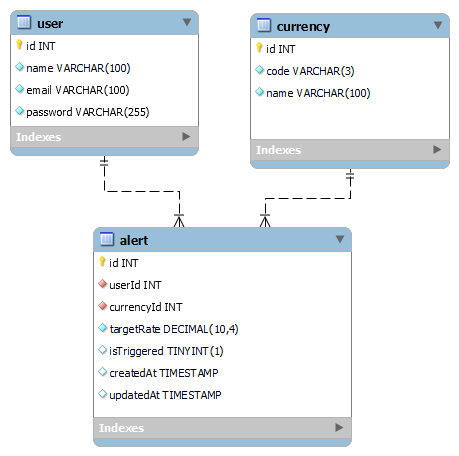

# Exploring-gitlab
# Currency Exchange Rate Tracker API

The Currency Exchange Rate Tracker API is a service that allows users to track exchange rates for different currencies and set up alerts when specific rates are reached.
## PART-1 : Database Design

The API uses a MySQL database with three tables: User, Currency, and Alert.
The API uses a MySQL database with the following table design:

### User Table

- id (primary key): integer
- name: string
- email: string
- password: string (hashed)

### Currency Table

- id (primary key): integer
- code: string
- name: string

### Alert Table

- id (primary key): integer
- userId (foreign key referencing User table): integer
- currencyId (foreign key referencing Currency table): integer
- targetRate: decimal
- isTriggered: boolean
- createdAt: datetime
- updatedAt: datetime

### Features in Database Design

<procee flowchart> 

1. Database Design:
   - Created three tables: User, Currency, and Alert.
   - User table stores user information.
   - Currency table stores currency information.
   - Alert table associates users with their desired currency alerts.

2. Real-time Rate Provider API Integration:
   - We would use functionality to fetch real-time exchange rates from the API.
   - we would Stored the exchange rate data in the database, updating existing records or inserting new ones.

3. Scheduled Updates:
   - Configured a scheduler or background job to update exchange rates at regular intervals (e.g., every 1 minute).

5. Check Target Rate:
   - During the update process, compared the current exchange rate with the target rate for each alert.
   - Marked the alert as triggered if the current rate was below the target rate. ( will set true or false value to isTrigged )

6. Email Notification Trigger:
   - Sent email notifications to users associated with triggered alerts.
   - Included relevant information such as the currency, current rate, target rate, etc.

## Optimation
I think after desinging the database , these steps could optimize the process.

1. Caching:
   - Implement a caching mechanism to store fetched exchange rates.
   - Reduce API calls and improve response times for subsequent requests.
   - Set an appropriate expiration time for the cache based on rate volatility.

2. Rate Limiting:
   - Check and comply with rate limits imposed by the exchange rate API provider.
   - Implement rate limiting in your application to prevent excessive API calls.
   - Efficiently utilize API resources and prevent unnecessary load on your system.

3. Batch Updates:
   - Insetead of single updates , We have to updates as Batch size.

4. Optimized Database Queries:
   - Optimize database queries for performance.
   - Use appropriate indexes on frequently used columns.
   - Monitor query performance and consider query optimization techniques.

## PART-2 API Contracts

The API exposes the following endpoints:

## API Endpoints

### Register a New User

- **URL:** `/api/users/register`
- **Method:** `POST`
- **Description:** Register a new user.
- **Request Body:**
  - `name` (string): User's name.
  - `email` (string): User's email.
  - `password` (string): User's password.
- **Responses:**
  - `200 OK`: User registration successful.

### User Login

- **URL:** `/api/users/login`
- **Method:** `POST`
- **Description:** User login.
- **Request Body:**
  - `email` (string): User's email.
  - `password` (string): User's password.
- **Responses:**
  - `200 OK`: User login successful.
  - `401 Unauthorized`: Invalid credentials.

### Get User Profile

- **URL:** `/api/users/profile`
- **Method:** `GET`
- **Description:** Get the user's profile information.
- **Security:** Bearer token required.
- **Responses:**
  - `200 OK`: User profile information.

### Update User Profile

- **URL:** `/api/users/profile`
- **Method:** `PUT`
- **Description:** Update the user's profile information.
- **Security:** Bearer token required.
- **Request Body:**
  - `name` (string): User's name.
  - `email` (string): User's email.
- **Responses:**
  - `200 OK`: User profile updated successfully.

### Change User Password

- **URL:** `/api/users/password`
- **Method:** `PUT`
- **Description:** Change the user's password.
- **Security:** Bearer token required.
- **Request Body:**
  - `currentPassword` (string): User's current password.
  - `newPassword` (string): User's new password.
- **Responses:**
  - `200 OK`: Password changed successfully.

### Create Currency Alert

- **URL:** `/api/alerts`
- **Method:** `POST`
- **Description:** Create a currency alert for a user.
- **Security:** Bearer token required.
- **Request Body:**
  - `currencyCode` (string): Currency code (e.g., USD, EUR).
  - `targetRate` (number): Desired exchange rate for the currency.
- **Responses:**
  - `200 OK`: Currency alert created successfully.

### Get Currency Alerts

- **URL:** `/api/alerts`
- **Method:** `GET`
- **Description:** Get all currency alerts for a user.
- **Security:** Bearer token required.
- **Responses:**
  - `200 OK`: List of currency alerts.

### Get Currency Alert by ID

- **URL:** `/api/alerts/{id}`
- **Method:** `GET`
- **Description:** Get a specific currency alert by ID.
- **Security:** Bearer token required.
- **Parameters:**
  - `id` (integer): ID of the currency alert.
- **Responses:**
  - `200 OK`: Currency alert information.

### Update Currency Alert

- **URL:** `/api/alerts/{id}`
- **Method:** `PUT`
- **Description:** Update a currency alert for a user.
- **Security:** Bearer token required.
- **Parameters:**
  - `id` (integer): ID of the currency alert.
- **Request Body:**
  - `targetRate` (number): Updated desired exchange rate for the currency.
- **Responses:**
  - `200 OK`: Currency

### Delete Currency Alert

- **URL:** `/api/alerts/{id}`
- **Method:** `DELETE`
- **Description:** Delete a currency alert for a user.
- **Security:** Bearer token required.
- **Parameters:**
  - `id` (integer): ID of the currency alert.
- **Responses:**
  - `200 OK`: Currency alert deleted successfully.

### Trigger Currency Alert

- **URL:** `/api/alerts/{id}/trigger`
- **Method:** `POST`
- **Description:** Manually trigger an alert for immediate notification.
- **Security:** Bearer token required.
- **Parameters:**
  - `id` (integer): ID of the currency alert.
- **Responses:**
  - `200 OK`: Alert triggered successfully.

ALl these above endpoints follow the base url as  `https://virtserver.swaggerhub.com/nagar2817/FinzTracker/1.0.0/api/`.

## API documentation 
Please go to this link , I have created an FinzTracker API Documention to better understand the above end points. 

https://app.swaggerhub.com/apis/nagar2817/FinzTracker/1.0.0

## References used to build this project
**SwaggerHub**
**Open API**
**MySql**
**Nodemailer** 
**ExpressJs**

